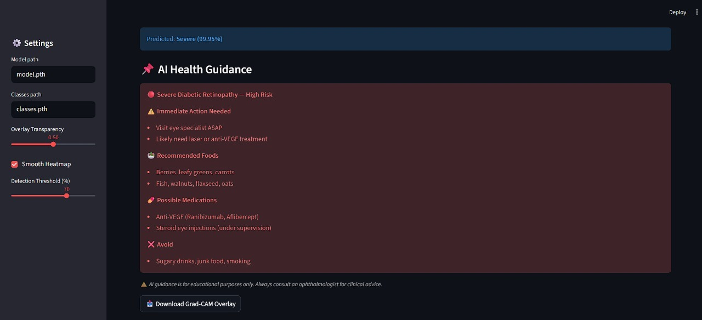
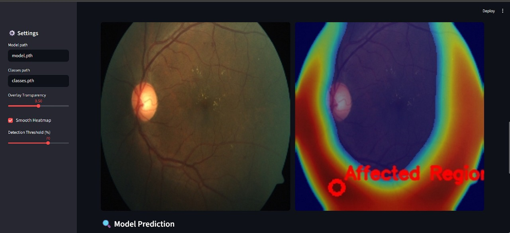

# Explainable Diabetic Retinopathy Detection using CNN and Grad-CAM

[](https://www.python.org/)
[](https://pytorch.org/)
[](https://streamlit.io/)
[](https://www.kaggle.com/code/eminkorkut/diabetic-retinopathy-with-cnn/input)

An end-to-end **Explainable AI system** for multi-class Diabetic Retinopathy (DR) classification using a custom Convolutional Neural Network (CNN) and Grad-CAM visualization, deployed through a Streamlit web application for real-time inference and interpretability.

---

## Table of Contents
- [Project Overview](#project-overview)
- [Dataset Description](#dataset-description)
- [Model Architecture](#model-architecture)
- [Training Pipeline](#training-pipeline)
- [Model Performance](#model-performance)
- [Explainability with Grad-CAM](#explainability-with-grad-cam)
- [Streamlit Deployment](#streamlit-deployment)
- [Clinical Decision Support Layer](#clinical-decision-support-layer)
- [Tech Stack](#tech-stack)
- [Project Structure](#project-structure)
- [Sample Screenshots](#sample-screenshots)
- [Setup & Installation](#setup--installation)

---

## Project Overview

Diabetic Retinopathy (DR) is a diabetes-related complication that affects the retina and can lead to vision loss if undetected.

This project builds:

- A custom CNN classifier for 5 DR severity stages  
- A Grad-CAM explainability pipeline  
- A real-time interactive Streamlit application  
- A clinical guidance layer based on prediction severity  

The system emphasizes **interpretability, robustness, and deployment readiness**, not just raw accuracy.

---

## Dataset Description

- **Source:** Kaggle Diabetic Retinopathy Dataset  
  https://www.kaggle.com/code/eminkorkut/diabetic-retinopathy-with-cnn/input

- **Total Images:** 3,554 retinal images  
- **Classes (5):**
  - No_DR
  - Mild
  - Moderate
  - Severe
  - Proliferate_DR

- **Split:** 80% Training / 20% Testing  
  - Train: 2,843  
  - Test: 711  

- **Preprocessing:**
  - Resize to 512×512  
  - Convert to tensor  

The dataset is not included in this repository due to size constraints.

---

## Model Architecture

Custom CNN implemented in PyTorch:

- 4 Convolutional Layers:
  - 3 → 32  
  - 32 → 64  
  - 64 → 128  
  - 128 → 256  
- ReLU activation  
- MaxPooling after each convolution  
- Dropout (0.25)  
- Fully connected head:
  - Flatten → 256 → 5 classes  

The flatten dimension is computed dynamically to maintain architectural flexibility.

---

## Training Pipeline

- Loss Function: `CrossEntropyLoss`  
- Optimizer: `Adam`  
- Learning Rate: `1e-3`  
- Epochs: 10  
- Batch Size: 16  

Training flow:

1. Load dataset 
2. Perform 80/20 train-test split
3. Train for 10 epochs
4. Evaluate on unseen test data
5. Save model weights and class metadata

---

## Model Performance

| Metric | Value |
|--------|--------|
| Test Accuracy | **98.31%** |
| Test Loss | 0.1716 |

The model achieves strong generalization despite not using transfer learning.

---

## Explainability with Grad-CAM

Medical AI systems require transparency.

This project includes two Grad-CAM implementations:

### Notebook-Based Explainability
- SmoothGradCAM++ (torchcam)
- Threshold-based hotspot detection
- Contour extraction
- Region highlighting

### Streamlit App Grad-CAM
- Manual forward/backward hooks
- Gradient-weighted feature maps
- Gaussian smoothing
- Background masking
- Activation threshold filtering
- Region localization and overlay blending

This allows visual interpretation of model decisions.

---

## Streamlit Deployment

The `app.py` provides:

- Image upload interface  
- Real-time prediction  
- Grad-CAM heatmap visualization  
- Adjustable transparency  
- Activation threshold control  
- Region highlighting  
- Downloadable overlay image  

---

## Clinical Decision Support Layer

Based on predicted severity, the app provides:

- Dietary suggestions

- Monitoring recommendations

- Visit frequency guidance

- Emergency alerts for severe conditions

**Note**: This guidance is educational and not a substitute for professional medical advice.

---

## Tech Stack

* **Language:** Python 3.8+  
* **Deep Learning Framework:** PyTorch, Torchvision  
* **Explainability:** Grad-CAM (Manual Implementation), TorchCAM (SmoothGradCAM++)  
* **Web Deployment:** Streamlit  
* **Image Processing:** OpenCV, PIL  
* **Visualization:** Matplotlib, NumPy  
* **Development:** Jupyter Notebook  

---

## Project Structure
```text
.
├── assets/                                # Grad-CAM outputs & screenshots
├── Dataset/                               # Retinal image dataset (not pushed)
│   ├── Mild/
│   ├── Moderate/
│   ├── No_DR/
│   ├── Severe/
│   └── Proliferate_DR/
├── app.py                                 # Streamlit Deployment App
├── training_testing.ipynb                 # Model Training & Evaluation
├── classes.pth                            # Class label metadata
├── model.pth                 
├── requirements.txt
└── README.md
```

---

## Sample Screenshots

### Model Prediction
*Displays the predicted Diabetic Retinopathy stage along with confidence score. The model achieves **98.31% test accuracy** on unseen data.*



---

### Grad-CAM Visualization
*Heatmap overlay highlighting the retinal regions that most influenced the model’s prediction. This improves interpretability and clinical trust.*


---

### Region Localization
*Threshold-based hotspot detection with contour/circle highlighting to precisely mark affected retinal regions.*


---

### Side-by-Side Comparison
*Original retinal image vs. Grad-CAM overlay for intuitive visual inspection.*



---

## Setup & Installation

### 1) Clone the Repo
```bash
git clone https://github.com/<your-username>/diabetic-retinopathy-detection.git
```

### 2) Install Dependencies
```bash
pip install -r requirements.txt
```

### 3) Prepare Dataset (Local)
Download the Kaggle DR dataset and place it here:
```text
project directory/
├── Dataset/
│   ├── Mild/
│   ├── Moderate/
│   ├── No_DR/
│   ├── Severe/
│   └── Proliferate_DR/
```

### 4) Model Weights
**Download pretrained weights from the link below:**

https://drive.google.com/drive/folders/17xAzYhKT4YDh69gGoJ5dfzIYJzeOufNa?usp=sharing

Place them inside the project directory

### 5) Run Streamlit App
```bash
streamlit run app.py
```
Visit the local URL to interact with the app.